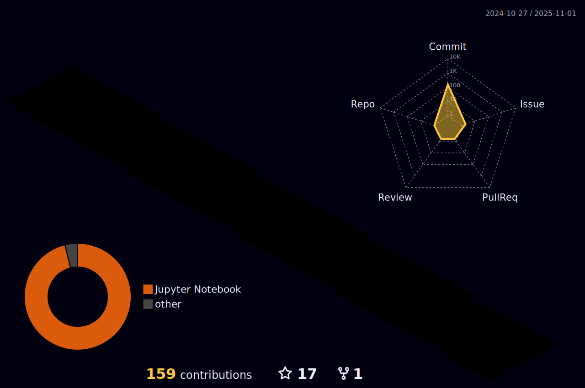

# Hi There ! 👋 🤗 👋

This is **ZHIYU LIU**, you can call me **LEO**. Welcome to my GitHub Page!

I'm currently a master student in **UIUC (University of Illinois Urbana-Champaign)** *(Illinois, USA)*.

I got my bachelor degree from **Tongji University** *(Shanghai, China)*. 

<!--
**leizhenyu-lzy/leizhenyu-lzy** is a ✨ _special_ ✨ repository because its `README.md` (this file) appears on your GitHub profile.

Here are some ideas to get you started:

- 🔭 I’m currently working on ...
- 🌱 I’m currently learning ...
- 👯 I’m looking to collaborate on ...
- 🤔 I’m looking for help with ...
- 💬 Ask me about ...
- 📫 How to reach me: ...
- 😄 Pronouns: ...
- ⚡ Fun fact: ...
-->

## 📊 Github Activity

  <picture style="width: 75%;">
    <source media="(prefers-color-scheme: dark)" srcset="https://github-readme-streak-stats.herokuapp.com?user=leizhenyu-lzy&theme=tokyonight&hide_border=true" />
    
  </picture>

<picture>
  <source media="(prefers-color-scheme: dark)" srcset="https://raw.githubusercontent.com/leizhenyu-lzy/leizhenyu-lzy/output/github-contribution-grid-snake-dark.svg">
  <source media="(prefers-color-scheme: light)" srcset="https://raw.githubusercontent.com/leizhenyu-lzy/leizhenyu-lzy/output/github-contribution-grid-snake.svg">
  
</picture>

## 📊 Github Stats

<!-- ## 📊 Leetcode Stats -->

<!--  -->

## 📊 Contribution Graph

<!--  -->

<!-- 

 -->

[Github 首页美化教程](https://zhuanlan.zhihu.com/p/454597068)
